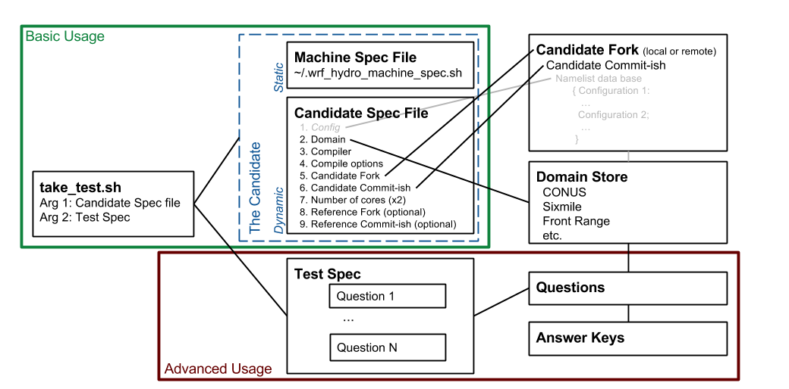

# wrf\_hydro\_tests: Testing for the WRF-Hydro model. #

Why use wrf\_hydro\_tests?

_Testing for the price of compiling:_ Developers can run engineering
tests with each compile with minimal added overhead when using toy
domains. This IS the way for developers to compile.

_Testing on a machine near you:_ This code is meant to work on any
linux distribution. The requirements are bash, python3, and the
dependencies of the WRF-Hydro model. It has been run on Docker and on
Chyenne (using qsub requires the wrf\_hydro\_tools repository at this
time) and is meant to be highly portable between different
environments. Example usages on both Docker and Cheyenne are provided
in the `examples/` directory.


# Overview / Definitions #

Purpose of this section

1. Define terms ("test" can be use in multiple, ambiguous ways),
1. Introduce users to what they need to get started. 

Advanced usage (defining custom tests or other development) is
deferred to a later section. 


## `take_test.sh` ##

A *candidate* takes a *test*. The take\_test name emphasizes that there
are two parts: the taker and the test. The `take_test` script is a
top-level driver routine which brings the two together. This is shown
on the left-hand side in Figure 1 below. 



The first argument to `take_test` is the candidate specification and
the second argument is the test specification. Running `take_tests`
with no arguments (or less than 2 arguments) produces help on both its
arguments. 

The `take_test` script broadly handles the following tasks:

1. Logging
1. Setup of the candidate
1. Taking of the test (including applying the answer keys)
1. Tearing down the candidate (optional)
1. Exiting


## The candidate ##

*The candidate is the most important aspect for new users to
master*. The candidate is ALL the necessary parts to
take a test. The particulars of the candidate are recorded in two files:

1. Machine specification file: nearly static for a given machine. 
1. Candidate specification file: the more dynamic parts.

These two files shoud uniquely identify a candidate. If you
dont find that to be true, please log an issue! 

Though wrf\_hydro\_tests can use environment variables defined outside
these two files (and we employ this fact in Docker applications), we
strongly encourage specifying all the necessary variables in the
candidate files.

### Machine specification file ###

The file `template_machine_spec.sh` (in the top level) provides a
template for the machine specifications. These should be installed
individually for each machine the first time it is used. Generally, we
recommend that the machine specification file for each machine be
installed in `~/.wrf_hydro_tests_machine_spec.sh` for each
user. However, this default location can be overridden in the
candidate specification file (described in the next subsection).

We note that there is a single machine specification file for our
Docker containers which can be found in `CI/machine_spec.sh` and also
with some of the docker examples,
i.e. `examples/nwm_ana/sixmile/docker/origin_reg-upstream/machine_spec.sh`. 

The machine specification file is commented to guide the user in its
setup. There is some conditional logic for modules on cheyenne, for
both GNU and intel compiler choices. 

In the "Getting Started" section below, there are detailed
instructions on setting up automated github authentication. If you
need to clone any private repositories, this will be required. This
will likely be the most foreign step of the entire process for users.

The function used to run the model is one of the more complicated
pieces of this file. When `mpirun` can be used, there is a function
which will work. When a job scheduler must be invoked, alternative
functions can be used. There is a function which runs on cheyenne but
requires functionality of the `wrf_hydro_tools` repository to
work. However, for each machine, this is is a one time problem even
across all users of `wrf_hydro_tests` on that machine.


### Candidate specification file ###
The file `template_candidate_spec.sh` (in the top level) needs
tailored by the user to specifiy the more dynamic parts of the
candidate. There are broad groups of "moving parts" to be specified
for a candidate:

1. Domain group
1. Compiler
1. Numer of cores group
1. Model compile options group
1. Candidate repository group
1. Reference repository group

There are currently a total of 22 variables which fall mostly in these
6 groups. Many are optional. The file is well commented and fairly
straight forward. This is the main file which you will use and become
familiar with.

In the `examples/` directory and the Examples section below, we offer
one way of oganizing candidate specification files for your
tests. "Inheritance" is possible for candidate specification files,
where a previous specification is used as the basis for a new
specification. For example, if only the compiler is changed, then the
previous specification is invoked followed by a change to the desired
compiler name. 

## Test specification file ##

The second argument to `take_test` is the test specification or test
specification file. There are pre-canned tests in the `tests/`
directory which can be invoked by simply using a tag (which is simply
the name of each *.sh file in that directory minus its extenstion.)
Running `take_tests` with no arguments prodoces help on this argument
and lists all the currently available tags.

If pre-canned tests do not meet your needs, an arbitrary test
specification file can be passed. *Tests*  are simply collections of
*questions*. Tests are one of the simplest parts of the system. (For
CI on CircleCI, tests are re-expressed in YAML mardown.) Custom tests
may simply mix and match stock questions. More advanced users will
want to develop custom tests with custom questions. Questions are
described in the Advanced Usage section below.


# Getting Started #

Before diving in to examples, we deal with some necessary details. 


## Managing the GITHUB environment variables. ##

In order to clone private repos (e.g. `wrf_hydro_nwm` or even
`wrf_hydro_tests` currently, though this should go public shortly),
without providing your authentication, you'll need to configure how
your github "authtoken". In the machine specification file you will
provide your github username. But the token is nice to keep
secret. The machine specification file assumes (i.e. if not modified
to look elsewhere) that your authtoken is store in your
`~/.github\_authtoken` file. This file should be READ-ONLY BY OWNER
(500). For example: 
```
jamesmcc@chimayo[736]:~/WRF_Hydro/wrf_hydro_docker/testing> ls -l ~/.github_authtoken 
-r--------  1 jamesmcc  rap  40 Nov  3 10:18 /Users/jamesmcc/.github_authtoken
```
The file contains the user authtoken from github with no carriage return or other 
whitespace in the file. See 

[https://help.github.com/articles/creating-a-personal-access-token-for-the-command-line/]

for information on getting your github authtoken.


## take_test in your path ##

After you run some of the canned examples, you'll want to start
calling `take_tests` in arbitrary locations where you put your own
candidate specification files. We recommend the following addition to
your ~/.bashrc or ~/.bash_profile. 

```
## wrf_hydro_tests
function take_test { /glade/u/home/`whoami`/some_path/wrf_hydro_tests/take_test.sh $@; }

```
If you are not a bash user, you should let us know what works for you.

# Think globally develop locally #

The recommended development workflow is:

1. On your local machine: write code
2. On your local machine: replace your compilation step with
   wrf\_hydro\_tests, using a toy domain. If your local machine is not
   Linux, setup and use docker locally. 
3. On cheyenne (or your large cluster): Periodically run tests on your
   code using larger domains and the intel compiler. This should
   eventually be handled by automated CI and cron-testing systems, but
   porting the testing to different domains on different machines
   should require minimal effort using wrf\_hydro\_tests.
   
The above workflow allows you the freedom to 1) not be connected to a
remote machine, 2) not be subject to downtime on a remote machine, 3)
understand not only if your code compiles at each step but also if any
fundamental engineering (or other) tests have changed, 4) save core
hour allocations on clusters. 

Note that code does NOT need to be committed to be tested under
wrf\_hydro\_tests when running locally (ie not under CI).
   

# Examples #

We begin with an example configured for cheyenne. 

Within the `examples/` directory, we have choosen to organize our
candidate files and examples of take_test calls using the following
directory/file structure:

`configuration/domain/machine/candidate-repo_reg-regression_repo/candidate_spec.sh`

Where the candidate specification may contain further indications of
details in the candidate necessary to differentiate from other
candidates in the same directory. The directory path specifies five of
the top-level pieces of information which differentiate candidates.


## 1. examples/nwm_ana/sixmile/cheyenne/origin_reg-v1.2-fixes/candidate_spec_intel.sh ##

You do not need to be able to run this example to see the complete
results. 

Here the National Water Model's "analysis and assimilation" cycle is
the configuration. This is a reference to both run time and
compile-time options, but mostly indicates the run-time options or
namelists which are used by the candidate in the tests. The domain is
specified next, as the sixmile creek domain, outside Ithaca N.Y. The
machine is cheyenne. The users remote origin fork on github will be
tested. Regression test will be against a branch refered to here as
"v1.2-fixes". Finally, the compiler is intel. 

This directory/file naming convention gives some strong insight into
what this test is about. However, the details are fully documented by
the `machine_spec.sh` and the `candidate_spec_intel.sh` files in this
directory. Reading these files will illuminate the paths to where the
compiled code resides, where the domains are found , where the runs
are actually performed, the exact modules loaded, the number of cores,
the WRF-Hydro compile options, and the locations of both the candidate
and reference repos (among other things). Please read and become
familiar with all the variables defined in the machine_spec.sh and
candidate_spec.sh files

The `how_to_take_test_intel_fundamental-regress-v1-2.sh` shows how
take_test.sh would be called on the candidate and paired with a stock
test. These commands would normally just be executed by a user on the
command line. 

machine spec file: qCleanRun function needs wrf\_hydro\_tools. What
else is of interest here?

The results of having run this test are logged to the file
`candidate_spec_intel_test_spec_fundamental-regress-v1-2-release-w-upgrades.log`. The
log file names derive from the candidate names and the test names, the
two things combined by `take_test.sh`. The log files are always placed
in the same directory as the candidate files and start with the
candidate spec filename for obvious collocation. Invoking `cat` on
this file shows what it looks like when a test runs. Only the `Logging
the candidateSpecFile` section is different, it does not appear in the
terminal when run interactively. We strive to log all the pertient
information at each step of the test. 

The top-level sections are:

1. Boilerplate: Logging some of the more fundamental information about
   the candidate and the test.
1. Setting up the candidate: establishing everything needed for the
   test to be taken. (Little or nothing currently printed here
1. Testing the candidate:

    1. Candidate fork: Getting and logging the fork + commit-ish (state of
           repo).
    1. Question: Compile?
    1. Question: Run?
    1. Question: Perfect restarts?
    1. Question: Number of cores tests?
    1. Reference fork: Getting and logging the fork + commit-ish (state
    of repo).
    1. Question: Regression test?

1. Results of all tests
1. Taking down the candidate
1. Logging the candidate

The regression test in this example intentionally fails to illustrate
what that looks like. 

Why v1.2-fixes? This example also illustrates that when the
configuration (the namelists, mostly) are not embedded with the model
code repo and not referenced against DOMAIN files, we have to build
separate run directories for each configuration. These configurations
have namelists which evolve over time. 


## 2. examples/nwm_ana/sixmile/cheyenne/origin_reg-v1.2-fixes/candidate_spec_intel.sh ##

This example is almost identical to the above except that we change
the compiler. Note that the WALL_TIME variable is also left out as
run-time may change significantly under different compilers. The
candidate spec file shows the poor-man's inheritance provided by
sourcing bash scripts and overriding pre-defined defaults. This
inheritance could be leveraged more than we are doing currently,
inside the directory structure we've established (but the inheritance
is a fairly new feature, so we've not fully exploited it).


# Advanced #

## Questions ##

Questions may 

1. return logical answers and require an *answer_key" ( e.g. "does x pass/fail), or 
1. return qualitative results (diagnostic outputs), e.g. "how does".

There are stock questions and you can create custom questions. 

Questions imply a known directory structure, but should remain Domain
agnostic. That is, the same test in multiple domains has the identical
directory structure. 

Questions typcially involve a premise, examples of premises:

	* There is a run
	* There is an existing run (ncores test, perfect restart tests)
	* There is a "blessed version of the code".
	
	
	* Questions are comprised of premises (given a, b, c) and may or may
	  not have answers (you can make custom questions too). 
	* The answer_key is invoked (by the question) to see if the testee's answers are
	  correct. 
	* Questions with answers should be ordered from most fundamental to
	  least fundamental and the test stops with the first failure. 
	* Questions without answers come at the end and only return
	  diagnostic/qualitative information.

questions/ 
	* are only about the candidate. (E.g. for a regression test, the
      question is about the candidate: does the candidate run 
	  match the reference run. All parts of compiling and running the 
	  reference binary should be contained in the question about
	  the regression of the candidate.)
	* should be summarized at the top of each question file. 
	* have defined run directory names that must be adhered to when
      constructing domains. 
	* 

## Deficiencies, on-going, & future work

*Namelist management* As noted, the candidate specification file does
not currently specify a model run-time configuration (set of namelist
options). Run-time configurations are currently static, which means
that different domain run directories have to be specified for
different model run-time configurations (the namelists live inside 
the established run directories for each domain). 

Work has begun to integrate JSON collections of preconfigured
namelists in to the code repository so that configurations can

1. be named,
1. be generated programatically at run time,
1. evolve with the code base, 
1. be guaranteed to work and produce consistent results across versions.

Perhaps the biggest probelm this will solve is tracking a given
configurations specific namelists across the development history (and
guaranteeing this by testing the code with the namelist maintained
across versions). The flexibility of mixing domains and configurations
will tremendously simply the complexity of testing as well. The above
work will also produce tools for generating and comparing namelists
programatically. 

*Domain file management* Domain files are continually evolving with
the code. Because of their size, it is simply not feasible to keep
domain files 


# Customizing & Contributing
Answer-changing code development:
1. Actuall answer changing parts should be isolated to a single commit
1. Should be diagnosed (on CONUS). 
You should write diagnostic tests in the flexible framework of
wrf\_hydro\_tests as you are developing code and evaluating its
impact. All such diagnostic testing can be used by others (and
yourself) next time the same variables are being worked on.


